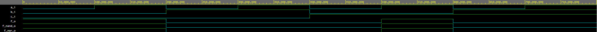
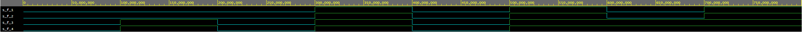

# CV 1

https://github.com/xgmitt00/Digital-electronics-1

## De Morgan's laws

### Link

https://www.edaplayground.com/x/VC9Z

### Source code

```vhdl
architecture dataflow of gates is
begin
    f_o  <= ((not b_i) and a_i) or ((not c_i) and (not b_i));
    f_nand_o <= (a_i nand (not b_i)) nand ((not b_i) nand (not c_i));
    f_nor_o <= (a_i nor (not c_i)) nor b_i;

end architecture dataflow;
```

### De Morgan's law simulation



### Table
| **c** | **b** |**a** | **f(c,b,a)** | **f_nand(c,b,a)** | **f_nor(c,b,a)** |
| :-: | :-: | :-: | :-: | :-: | :-: |
| 0 | 0 | 0 | 1 | 1 | 1 |
| 0 | 0 | 1 | 1 | 1 | 1 |
| 0 | 1 | 0 | 0 | 0 | 0 |
| 0 | 1 | 1 | 0 | 0 | 0 |
| 1 | 0 | 0 | 0 | 0 | 0 |
| 1 | 0 | 1 | 1 | 1 | 1 |
| 1 | 1 | 0 | 0 | 0 | 0 |
| 1 | 1 | 1 | 0 | 0 | 0 |

## Distributive laws

### Link

https://www.edaplayground.com/x/8QAA

### Source code

```vhdl
architecture dataflow of gates is
begin
    f_dist1_o  <= (x_i and y_i) or (x_i and z_i);
    f_dist2_o  <= x_i and (y_i or z_i);
    f_dist3_o  <= (x_i or y_i) and (x_i or z_i);
    f_dist4_o  <= x_i or (y_i and z_i);

end architecture dataflow;
```

### Distributive law simulation


