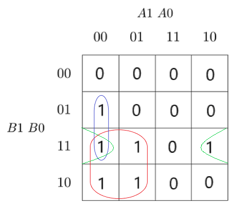
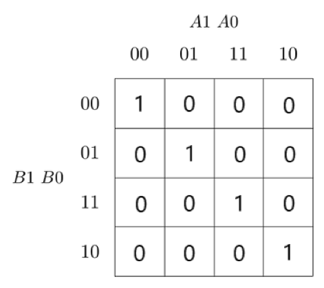
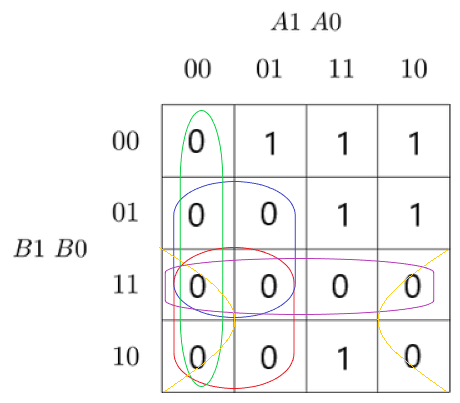
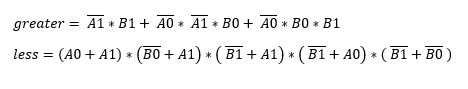
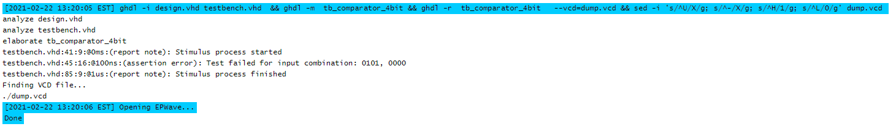

# CV 2

https://github.com/xgmitt00/Digital-electronics-1


## 2-bit comparator

### Link

https://www.edaplayground.com/x/V6fH

### Table

| **Dec. equivalent** | **B[1:0]** | **A[1:0]** | **B is greater than A** | **B equals A** | **B is less than A** |
| :-: | :-: | :-: | :-: | :-: | :-: |
| 0 | 0 0 | 0 0 | 0 | 1 | 0 |
| 1 | 0 0 | 0 1 | 0 | 0 | 1 |
| 2 | 0 0 | 1 0 | 0 | 0 | 1 |
| 3 | 0 0 | 1 1 | 0 | 0 | 1 |
| 4 | 0 1 | 0 0 | 1 | 0 | 0 |
| 5 | 0 1 | 0 1 | 0 | 1 | 0 |
| 6 | 0 1 | 1 0 | 0 | 0 | 1 |
| 7 | 0 1 | 1 1 | 0 | 0 | 1 |
| 8 | 1 0 | 0 0 | 1 | 0 | 0 |
| 9 | 1 0 | 0 1 | 1 | 0 | 0 |
| 10 | 1 0 | 1 0 | 0 | 1 | 0 |
| 11 | 1 0 | 1 1 | 0 | 0 | 1 |
| 12 | 1 1 | 0 0 | 1 | 0 | 0 |
| 13 | 1 1 | 0 1 | 1 | 0 | 0 |
| 14 | 1 1 | 1 0 | 1 | 0 | 0 |
| 15 | 1 1 | 1 1 | 0 | 1 | 0 |

### Karnaugh maps

#### B is greater than A



#### B equals A



#### B is less than A



### Equations of simplified SoP form of the "greater than" function and simplified PoS form of the "less than" function




## 4-bit binary comparator

### Link

https://www.edaplayground.com/x/vPhe

### VHDL architecture

```vhdl
architecture Behavioral of comparator_4bit is
begin

    B_less_A_o     <= '1' when (b_i < a_i) else '0';
    B_greater_A_o  <= '1' when (b_i > a_i) else '0';
    B_equals_A_o   <= '1' when (b_i = a_i) else '0';

end architecture Behavioral;
```

### VHDL stimulus process

```vhdl
 p_stimulus : process
    begin
        
        report "Stimulus process started" severity note;


		s_b <= "0101"; s_a <= "0000"; wait for 100 ns;
		assert ((s_B_greater_A = '1') and (s_B_equals_A = '0') and (s_B_less_A = '1'))
		report "Test failed for input combination: 0101, 0000" severity error;

		s_b <= "0101"; s_a <= "0001"; wait for 100 ns;
		assert ((s_B_greater_A = '1') and (s_B_equals_A = '0') and (s_B_less_A = '0'))
		report "Test failed for input combination: 0101, 0001" severity error;

		s_b <= "0101"; s_a <= "0010"; wait for 100 ns;
		assert ((s_B_greater_A = '1') and (s_B_equals_A = '0') and (s_B_less_A = '0'))
		report "Test failed for input combination: 0101, 0010" severity error;

		s_b <= "0101"; s_a <= "0011"; wait for 100 ns;
		assert ((s_B_greater_A = '1') and (s_B_equals_A = '0') and (s_B_less_A = '0'))
		report "Test failed for input combination: 0101, 0011" severity error;

		s_b <= "0101"; s_a <= "0100"; wait for 100 ns;
		assert ((s_B_greater_A = '1') and (s_B_equals_A = '0') and (s_B_less_A = '0'))
		report "Test failed for input combination: 0101, 0100" severity error;

		s_b <= "0101"; s_a <= "0101"; wait for 100 ns;
		assert ((s_B_greater_A = '0') and (s_B_equals_A = '1') and (s_B_less_A = '0'))
		report "Test failed for input combination: 0101, 0101" severity error;

		s_b <= "0101"; s_a <= "0110"; wait for 100 ns;
		assert ((s_B_greater_A = '0') and (s_B_equals_A = '0') and (s_B_less_A = '1'))
		report "Test failed for input combination: 0101, 0110" severity error;

		s_b <= "0101"; s_a <= "0111"; wait for 100 ns;
		assert ((s_B_greater_A = '0') and (s_B_equals_A = '0') and (s_B_less_A = '1'))
		report "Test failed for input combination: 0101, 0111" severity error;

		s_b <= "0101"; s_a <= "1000"; wait for 100 ns;
		assert ((s_B_greater_A = '0') and (s_B_equals_A = '0') and (s_B_less_A = '1'))
		report "Test failed for input combination: 0101, 1000" severity error;

		s_b <= "0101"; s_a <= "1001"; wait for 100 ns;
		assert ((s_B_greater_A = '0') and (s_B_equals_A = '0') and (s_B_less_A = '1'))
		report "Test failed for input combination: 0101, 1001" severity error;
        

        report "Stimulus process finished" severity note;
        wait;
    end process p_stimulus;
```

### Simulator console output with one reported error


