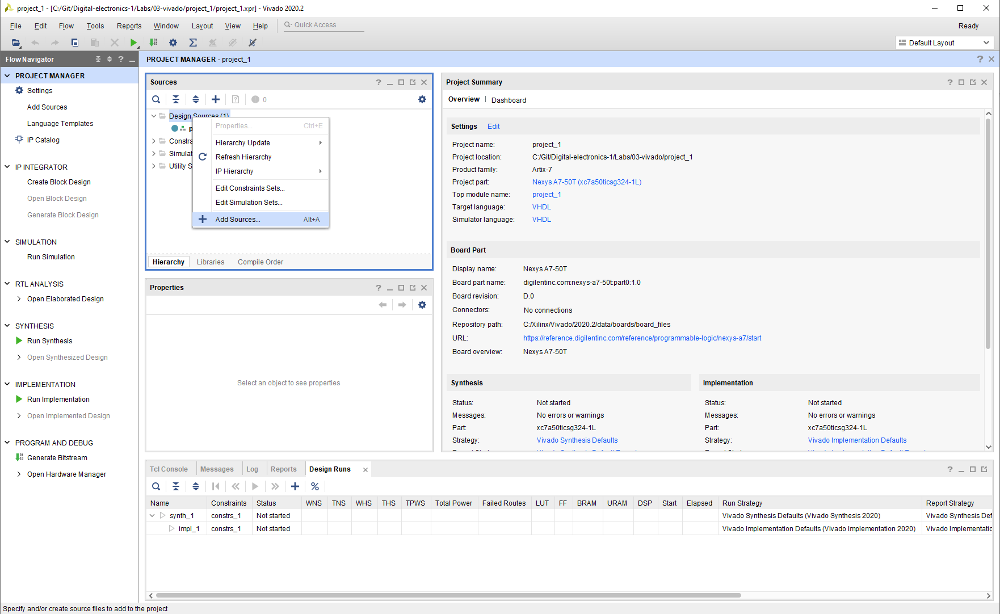
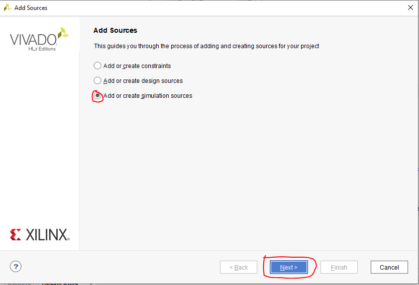
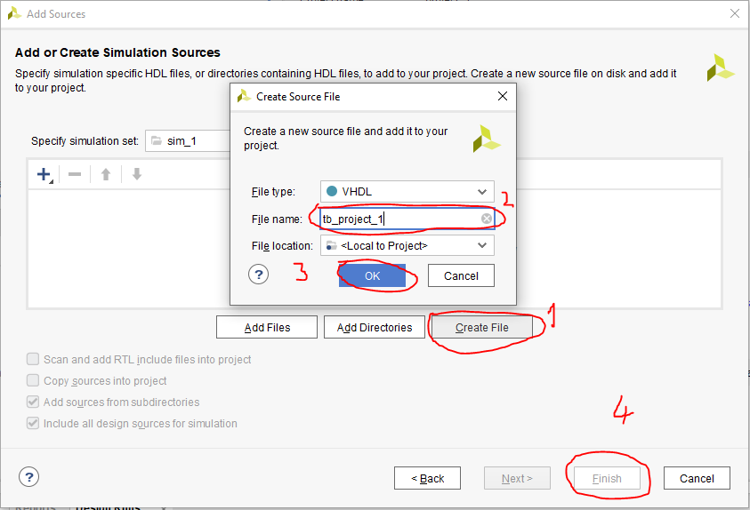

# CV 3

https://github.com/xgmitt00/Digital-electronics-1

## Table

| **Name** | **Port** |**Function** |
| :-: | :-: | :-: | 
| J15 | a_i[0] | SW0 | 
| L16 | a_i[1] | SW1 |
| M13 | b_i[0] | SW2 |
| R15 | b_i[1] | SW3 |
| R17 | c_i[0] | SW4 |
| T18 | c_i[1] | SW5 |
| U18 | d_i[0] | SW6 |
| R13 | d_i[1] | SW7 |
| U11 | sel_i[0] | SW7 |
| V10 | sel_i[1] | SW7 |
| H17 | f_o[0] | LD0 |
| K15 | f_o[1] | LD1 |

## Two-bit wide 4-to-1 multiplexer

### VHDL architecture

```vhdl
architecture Behavioral of mux_2bit_4to1 is
begin

    f_o <= a_i when (sel_i = "00") else
           b_i when (sel_i = "01") else
           c_i when (sel_i = "10") else
           d_i;

end architecture Behavioral;
```

### VHDL stimulus process

```vhdl
 begin
        report "Stimulus process started" severity note;
         s_d <= "00"; 
         s_c <= "00"; 
         s_b <= "00"; 
         s_a <= "10";
         s_sel <= "00"; 
         wait for 200 ns;
         s_d <= "00"; 
         s_c <= "11"; 
         s_b <= "00"; 
         s_a <= "01";
         s_sel <= "10"; 
         wait for 200 ns;
         s_d <= "01"; 
         s_c <= "00"; 
         s_b <= "10"; 
         s_a <= "00";
         s_sel <= "11"; 
         wait for 200 ns;
         s_d <= "10"; 
         s_c <= "11"; 
         s_b <= "01"; 
         s_a <= "11";
         s_sel <= "10"; 
         wait for 200 ns;
         s_d <= "11"; 
         s_c <= "00"; 
         s_b <= "10"; 
         s_a <= "01";
         s_sel <= "10"; 
         wait for 200 ns;
         s_d <= "10"; 
         s_c <= "11"; 
         s_b <= "01"; 
         s_a <= "00";
         s_sel <= "11"; 
         wait for 200 ns;
         s_d <= "10"; 
         s_c <= "11"; 
         s_b <= "01"; 
         s_a <= "01";
         s_sel <= "01"; 
         wait for 200 ns;
        report "Stimulus process finished" severity note;
        wait;
    end process p_stimulus;
```
### Simulation


## Vivado tutorial

### Project creation


### Adding testbench file





### Running simulation

