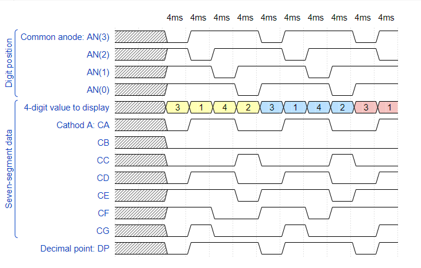

# CV 6

https://github.com/xgmitt00/Digital-electronics-1

## Timing diagram



## Display driver
### VHDL code
```vhdl
p_mux : process(s_cnt, data0_i, data1_i, data2_i, data3_i, dp_i)
begin
        case s_cnt is
            when "11" =>
                s_hex <= data3_i;
                dp_o  <= dp_i(3);
                dig_o <= "0111";
            when "10" =>
                s_hex <= data2_i;
                dp_o  <= dp_i(2);
                dig_o <= "1011";
            when "01" =>
                s_hex <= data1_i;
                dp_o  <= dp_i(1);
                dig_o <= "1101";
            when others =>
                s_hex <= data0_i;
                dp_o  <= dp_i(0);
                dig_o <= "1110";
    end case;
end process p_mux;
```
### VHDL testbench
```vhdl
library ieee;
use ieee.std_logic_1164.all;

entity tb_driver_7seg_4digits is
end entity tb_driver_7seg_4digits;

architecture testbench of tb_driver_7seg_4digits is

    constant c_CLK_100MHZ_PERIOD : time    := 10 ns;
    signal s_clk_100MHz : std_logic;           
    signal s_reset      : std_logic;    
    signal s_data0      : std_logic_vector(4 - 1 downto 0);
    signal s_data1      : std_logic_vector(4 - 1 downto 0);
    signal s_data2      : std_logic_vector(4 - 1 downto 0);
    signal s_data3      : std_logic_vector(4 - 1 downto 0);    
    signal s_dp_i       : std_logic_vector(4 - 1 downto 0);
    signal s_dp_o       : std_logic;
    signal s_seg_o      : std_logic_vector(7 - 1 downto 0);    
    signal s_dig        : std_logic_vector(4 - 1 downto 0);

begin
    
    uut_driver_7seg_4digits : entity work.driver_7seg_4digits
        port map(
            clk => s_clk_100MHz,
            reset => s_reset,

            data0_i => s_data0,
            data1_i => s_data1,
            data2_i => s_data2,
            data3_i => s_data3,
            dp_i => s_dp_i,
            dp_o  => s_dp_o,
            seg_o => s_seg_o,
            dig_o => s_dig
        );
    p_clk_gen : process
    begin
        while now < 750 ns loop    
            s_clk_100MHz <= '0';
            wait for c_CLK_100MHZ_PERIOD / 2;
            s_clk_100MHz <= '1';
            wait for c_CLK_100MHZ_PERIOD / 2;
        end loop;
        wait;
    end process p_clk_gen;
    p_reset_gen : process
    begin
        s_reset <= '0';
        wait for 28 ns;        
        s_reset <= '1';
        wait for 53 ns;
        s_reset <= '0';
        wait;
    end process p_reset_gen;
    p_stimulus : process
    begin
        report "Stimulus process started" severity note;
        report "T1" severity note;
        s_data3 <= "0011";
        wait for 10 ns;
        assert (s_seg_o = "0000110")
        report "T1 failed" severity error;
        
        report "T2" severity note;
        s_data2 <= "0001";
        wait for 10 ns;
        assert (s_seg_o = "1001111")
        report "T2 failed" severity error; 
        
        report "T3" severity note;
        s_data1 <= "0100";
        wait for 10 ns;
        assert (s_seg_o = "1001100")
        report "T3 failed" severity error; 
        
        report "T4" severity note;
        s_data0 <= "0010";
        wait for 10 ns;
        assert (s_seg_o = "0010010")
        report "T4 failed" severity error; 
               
        s_dp_i <= "0111";

        report "Stimulus process finished" severity note;
        wait;
    end process p_stimulus;
end architecture testbench;
```
