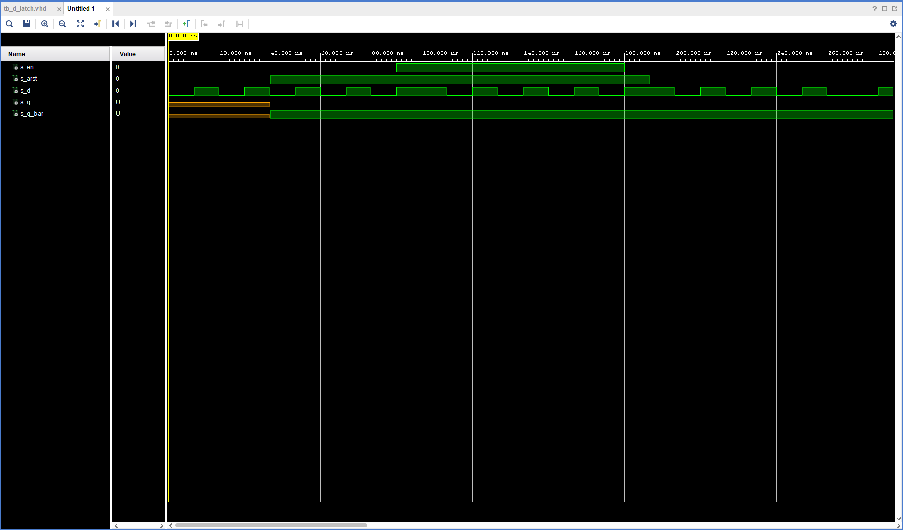
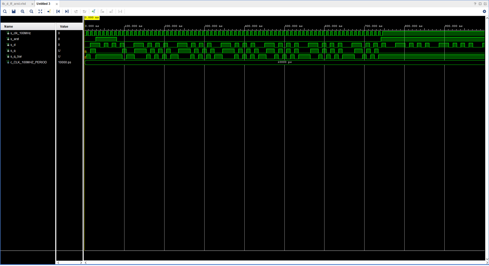
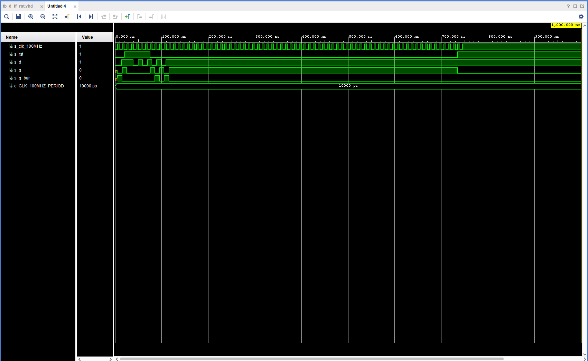
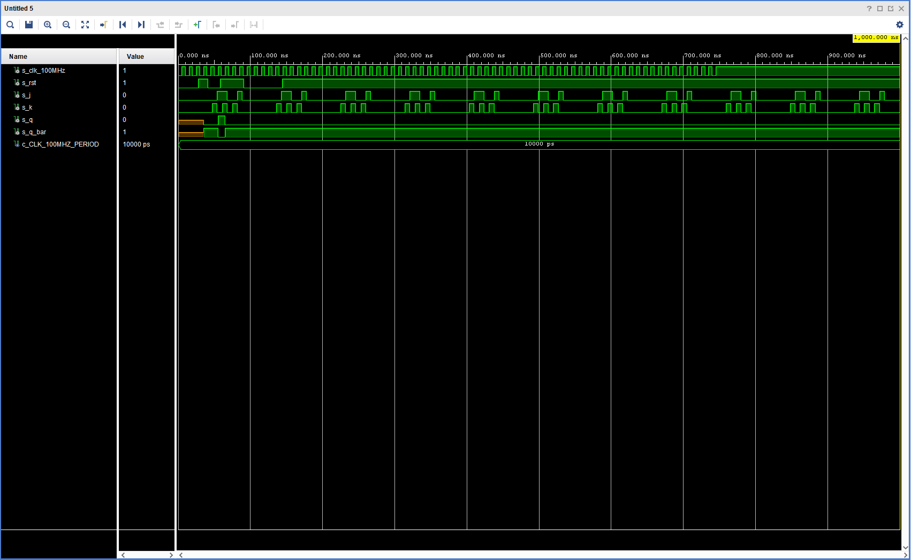
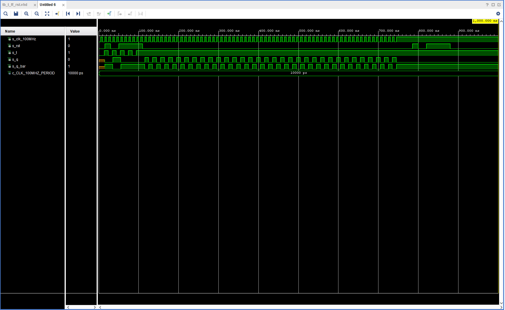

# CV 7

https://github.com/xgmitt00/Digital-electronics-1

## Characteristic equations and completed tables for flip-flops

### Table for D
| D | Qn | Q(n+1) | Comments |
| :-: | :-: | :-: | :-- |
| 0 | 0 | 0 | |
| 0 | 1 | 0 | |
| 1 | 0 | 1 | |
| 1 | 1 | 1 | |

### Table for JK
| J | K | Qn | Q(n+1) | Comments |
| :-: | :-: | :-: | :-: | :-- |
| 0 | 0 | 0 | 0 | No change |
| 0 | 0 | 1 | 1 | No change |
| 0 | 1 | 0 | 0 | Reset |
| 0 | 1 | 1 | 0 | Reset |
| 1 | 0 | 0 | 1 | Set |
| 1 | 0 | 1 | 1 | Set |
| 1 | 1 | 0 | 1 | Inverter |
| 1 | 1 | 1 | 0 | Inverter |

### Table for T
| T | Qn | Q(n+1) | Comments |
| :-: | :-: | :-: | :-- |
| 0 | 0 | 0 | Memory |
| 0 | 1 | 1 | Memory |
| 1 | 0 | 1 | Inverter |
| 1 | 1 | 0 | Inverter |

## D latch
### VHDL code listing of the process p_d_latch
```vhdl
p_d_latch : process (d, arst, en)
begin
    if (arst = '1') then
        q <= '0';
        q_bar <= '1';
    elsif(en = '1') then
        q <= d;
        q_bar <= not d;
    end if;
end process p_d_latch;
```
### Listing of VHDL reset and stimulus processes from the testbench 
```vhdl
 p_reset_gen : process
    begin
        s_arst <= '0';
        wait for 40 ns;        
        s_arst <= '1';
        wait for 150 ns;
        s_arst <= '0';
        wait;
    end process p_reset_gen;    
    ---------------------------------------------      
    p_stimulus : process
    begin
        report "Stimulus process started" severity note;       
        s_d <= '0';
        s_en <= '0';             
        wait for 10 ns;
        s_d <= '1';
        wait for 10 ns;
        s_d <= '0';
        wait for 10 ns;
        s_d <= '1';
        wait for 10 ns;
        s_d <= '0';
        wait for 10 ns;
        s_d <= '1';
        wait for 10 ns;
        s_d <= '0';
        wait for 10 ns;
        s_d <= '1';
        wait for 10 ns;
        s_d <= '0';
        wait for 10 ns;
        s_d <= '1';        
        s_en <= '1';       
        wait for 10 ns;
        s_d <= '1';
        wait for 10 ns;
        s_d <= '0';
        wait for 10 ns;
        s_d <= '1';
        wait for 10 ns;
        s_d <= '0';
        wait for 10 ns;
        s_d <= '1';
        wait for 10 ns;
        s_d <= '0';
        wait for 10 ns;
        s_d <= '1';
        wait for 10 ns;
        s_d <= '0';
        wait for 10 ns;
        s_d <= '1';       
        s_en <= '0';        
        wait for 10 ns;
        s_d <= '1';
        wait for 10 ns;
        s_d <= '0';
        wait for 10 ns;
        s_d <= '1';
        wait for 10 ns;
        s_d <= '0';
        wait for 10 ns;
        s_d <= '1';
        wait for 10 ns;
        s_d <= '0';
        wait for 10 ns;
        s_d <= '1';
        wait for 10 ns;
        s_d <= '0';
        wait for 10 ns;
        s_d <= '1';        
        report "Stimulus process finished" severity note;    
    end process p_stimulus;
```
### Screenshot with simulated time waveforms



## Flip-flops
## VHDL code listing of the processes
### p_d_ff_arst
```vhdl
p_d_latch : process (clk, arst)
begin
    if (arst = '1') then
        q <= '0';
        q_bar <= '1';
    elsif rising_edge(clk) then
        q <= d;
        q_bar <= not(d);
    end if;
end process p_d_latch;
```
### p_d_ff_rst
```vhdl
d_ff_rst : process (clk)
begin
    if rising_edge(clk) then
        if (rst = '1')then
            q <= '0';
        else
            q <= d;
            q_bar <= not(d);                  
        end if;           
    end if;
end process d_ff_rst;
```
### p_jk_ff_rst
```vhdl
p_d_latch : process (clk)
begin
if rising_edge(clk) then
  if(rst = '1') then
      s_q <= '0';
  else 
      if(j = '0' and k = '0') then
          s_q <= s_q;          
      elsif(j = '0' and k = '1') then
          s_q <= '0';           
      elsif(j = '1' and k = '0') then
          s_q <= '1';            
      elsif(j = '1' and k = '1') then
          s_q <= not s_q;
      end if;
  end if;
end if;  
end process p_d_latch;
```
### p_t_ff_rst
```vhdl
t_ff_rst : process (clk)
begin
    if rising_edge(clk) then
        if (rst = '1')then
            s_q <= '0';
        else
            if(t = '0')then
               s_q <= s_q;
            elsif(t = '1')then
               s_q <= not s_q;
            end if;
        end if;        
    end if;
end process t_ff_rst;
```
## Listing of VHDL clock, reset and stimulus processes from the testbench files
### d_ff_arst
```vhdl
    p_clk_gen : process
    begin
        while now < 750 ns loop         
            s_clk_100MHz <= '0';
            wait for c_CLK_100MHZ_PERIOD / 2;
            s_clk_100MHz <= '1';
            wait for c_CLK_100MHZ_PERIOD / 2;
        end loop;
        wait;
    end process p_clk_gen;
        
    p_reset_gen : process
    begin
        s_arst <= '0';
        wait for 28 ns;
        s_arst <= '1';
        wait for 53 ns;
        s_arst <= '0';
        wait for 660 ns;       
        s_arst <= '1';
        wait;
    end process p_reset_gen;   
 
    p_stimulus : process
    begin
        report "Stimulus process started" severity note;      
        s_d <= '0';      
        wait for 14 ns;
        s_d <= '1';
        wait for 25 ns;
        s_d <= '0';       
        wait for 6 ns;     
        wait for 4 ns;
        s_d <= '1';
        wait for 10 ns;
        s_d <= '0';
        wait for 10 ns;
        s_d <= '1';
        wait for 10 ns;
        s_d <= '0';
        wait for 10 ns;
        s_d <= '1';
        wait for 10 ns;
        s_d <= '0';
        wait for 10 ns;
        s_d <= '1';      
        report "Stimulus process finished" severity note;    
    end process p_stimulus;
```
### Screenshot with simulated time waveforms



### d_ff_rst
```vhdl
p_clk_gen : process
    begin
        while now < 750 ns loop        
            s_clk_100MHz <= '0';
            wait for c_CLK_100MHZ_PERIOD / 2;
            s_clk_100MHz <= '1';
            wait for c_CLK_100MHZ_PERIOD / 2;
        end loop;
        wait;
    end process p_clk_gen;

p_reset : process
    begin
        s_rst <= '0';
        wait for 20 ns;
        s_rst <= '1';
        wait for 55 ns;  
        s_rst <= '0';
        wait for 660 ns;
        s_rst <= '1';
        wait;
    end process p_reset;
    
p_stimulus : process
    begin
        report "Stimulus process started" severity note;       
        s_d <= '0';     
        wait for 14 ns;
        s_d <= '1';
        wait for 25 ns;
        s_d <= '0';
        wait for 6 ns;
        wait for 4 ns;
        s_d <= '1';
        wait for 10 ns;
        s_d <= '0';
        wait for 10 ns;
        s_d <= '1';
        wait for 10 ns;
        s_d <= '0';
        wait for 10 ns;
        s_d <= '1';
        wait for 10 ns;
        s_d <= '0';
        wait for 10 ns;
        s_d <= '1';     
        report "Stimulus process finished" severity note;
        wait;
    end process p_stimulus;
```
### Screenshot with simulated time waveforms



### jk_ff_rst
```vhdl
p_clk_gen : process
    begin
        while now < 750 ns loop         
            s_clk_100MHz <= '0';
            wait for c_CLK_100MHZ_PERIOD / 2;
            s_clk_100MHz <= '1';
            wait for c_CLK_100MHZ_PERIOD / 2;
        end loop;
        wait;
    end process p_clk_gen;
        
p_reset_gen : process
    begin
        s_rst <= '0';
        wait for 28 ns;
        s_rst <= '1';
        wait for 13 ns;
        s_rst <= '0';
        wait for 17 ns;        
        s_rst <= '1';
        wait for 33 ns;        
        s_rst <= '0';
        wait for 53 ns;       
        s_rst <= '1';
        wait;
    end process p_reset_gen;

p_stimulus : process
    begin
        report "Stimulus process started" severity note;       
        s_j <= '0';
        s_k <= '0';        
        wait for 40 ns;
        s_j <= '0';
        s_k <= '0';        
        wait for 7 ns;
        s_j <= '0';
        s_k <= '1';        
        wait for 7 ns;
        s_j <= '1';
        s_k <= '0';
        wait for 7 ns;
        s_j <= '1';
        s_k <= '1';        
        wait for 7 ns;
        s_j <= '0';
        s_k <= '0';        
        wait for 7 ns;
        s_j <= '0';
        s_k <= '1';     
        wait for 7 ns;
        s_j <= '1';
        s_k <= '0';
        wait for 7 ns;
        s_j <= '1';
        s_k <= '1';        
        report "Stimulus process finished" severity note;    
    end process p_stimulus;
```
### Screenshot with simulated time waveforms



### t_ff_rst
```vhdl
p_clk_gen : process
    begin
        while now < 750 ns loop        
            s_clk_100MHz <= '0';
            wait for c_CLK_100MHZ_PERIOD / 2;
            s_clk_100MHz <= '1';
            wait for c_CLK_100MHZ_PERIOD / 2;
        end loop;
        wait;
    end process p_clk_gen;

p_reset : process
    begin
        s_rst <= '0';
        wait for 15 ns;
        s_rst <= '1';
        wait for 15 ns;  
        s_rst <= '0';
        wait for 20 ns;
        s_rst <= '1';
        wait for 60 ns;
        s_rst <= '0';
        wait for 660 ns;
        s_rst <= '1'; 
    end process p_reset;
    
p_stimulus : process
    begin
        report "Stimulus process started" severity note;       
        s_t <= '0';      
        wait for 14 ns;
        s_t <= '1';
        wait for 10 ns;
        s_t <= '0';   
        wait for 6 ns;
        wait for 4 ns;
        s_t <= '1';
        wait for 10 ns;
        s_t <= '0';
        wait for 10 ns;
        s_t <= '1';
        wait for 10 ns;
        s_t <= '0';
        wait for 10 ns;
        s_t <= '1';
        wait for 10 ns;
        s_t <= '0';
        wait for 10 ns;
        s_t <= '1';         
        report "Stimulus process finished" severity note;
        wait;
    end process p_stimulus;
```
### Screenshot with simulated time waveforms


