# Projekt - Parkovací asistent

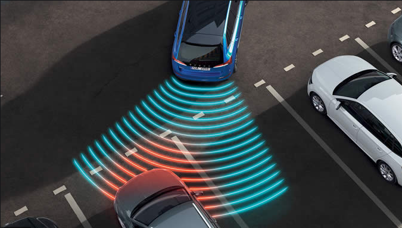 

## Členové týmu:
| **Jméno(ID)** | **GitHub** |
| :-: | :-: |
| Gmitter Jakub (220814)  | [Link](https://github.com/xgmitt00/Digital-electronics-1/tree/main/Labs)     |
| Golian Igor (223288)    | [Link](https://github.com/golian-igor/Digital-electronics-1/tree/main/Labs)  |
| Grenčík Dominik (220815)| [Link](https://github.com/DomikGrencik/Digital-electronics-1/tree/main/Labs) |
| Hála David (220889)     | [Link](https://github.com/DavidHala123/Digital-electronics-1/tree/main/Labs) |

## Zadání projektu:
Parkovací asistent s ultrazvukovým senzorem HC-SR04, zvuková signalizace pomocí PWM, signalizace pomocí LED bargrafu

## Cíl projektu:
Cílem projektu je vytvořit program  parkovací asistent, který bude napsaný v jazyce VHDL na desce A7-100T. Nejdůležitější částí programu tvoří ultrazvukový senzor HC-SR04, který zajišťuje vzdálenost od jednotlivých překážek. Senzor je doplněn LED bargrafem, který se bude postupně rozsvicovat podle dané vzdálenosti od překážek. Program také obsahuje zvukovou signalizaci pomocí bzučáku, který má za úkol upozornit na blížící se předmět. 

## Popis Hardwaru:
### Deska A7-100T
Deska je kompletní platforma pro vývoj digitálních obvodů. Založená na nejnovějším poli FPGA od společnosti Artix-7 ™. Díky velkému vysokokapacitnímu FPGA, velkorysým externím pamětím, kolekci USB, Ethernetu a dalších portů může A7 hostit designy od úvodních kombinačních obvodů až po výkonné vestavěné procesory.

#### Popis Desky:
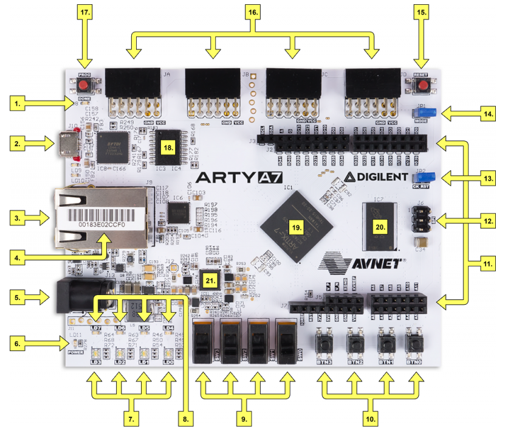

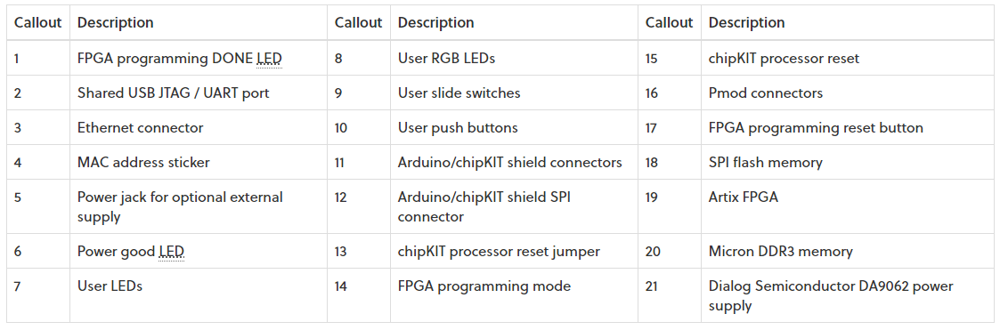

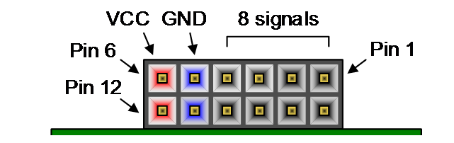

#### Připojení pinů
| **Pmod JA** | **Connection** | **Pmod JB** | **Connection** | **Pmod JC** |**Connection** | **Pmod JD** |**Connection** |
| :-: | :-: | :-: | :-: | :-: | :-: | :-: | :-: |
| Pin 1  | G13 | Pin 1  | E15 | Pin 1  | U12 | Pin 1  | D4 |
| Pin 2  | B11 | Pin 2  | E16 | Pin 2  | V12 | Pin 2  | D3 |
| Pin 3  | A11 | Pin 3  | D15 | Pin 3  | V10 | Pin 3  | F4 |
| Pin 4  | D12 | Pin 4  | C15 | Pin 4  | V11 | Pin 4  | F3 |
| Pin 7  | D13 | Pin 7  | J17 | Pin 7  | U14 | Pin 7  | E2 |
| Pin 8  | B18 | Pin 8  | J18 | Pin 8  | V14 | Pin 8  | D2 |
| Pin 9  | A18 | Pin 9  | K15 | Pin 9  | T13 | Pin 9  | H2 |
| Pin 10 | K16 | Pin 10 | J15 | Pin 10 | U13 | Pin 10 | G2 |

#### Senzor HC-SR04
| | **Pmod** | **Connection** |
| :-: | :-: | :-: |
| Trig | JC - Pin 1 | U12 |
| Echo | JA - Pin 7 | G13 |
| VCC  | 5V         | External source |
| GND  | GND        | External source |

#### Bzučák
| | **Pmod** | **Connection** |
| :-: | :-: | :-: |
| Signal | JC - Pin 2 | V12 |
| VCC    | JC - Pin 6 | VCC |
| GND    | JC - Pin 5 | GND |

#### LED bargraf
| | **Pmod** | **Connection** |
| :-: | :-: | :-: |
| LED1 | JB - Pin 1  | E15 |
| LED2 | JB - Pin 2  | E16 |
| LED3 | JB - Pin 3  | D15 |
| LED4 | JB - Pin 4  | C15 |
| LED5 | JB - Pin 7  | J17 |
| LED6 | JB - Pin 8  | J18 |
| LED7 | JB - Pin 9  | K15 |
| LED8 | JB - Pin 10 | J15 |
| VCC  | JB - Pin 6  | VCC |
| GND  | JB - Pin 5  | GND |

### Senzor HC-SR04
Ultrazvukový senzor, který slouží především jako detektor překážek. Měřící vzdálenost je v rozsahu od 2cm do 4m. Obsahuje 4 pinový konektor se standartní roztečí 2,54mm. Piny: VCC, GND, TRIG, ECHO. Princip funkce senzoru: Nejprve vyšle 10us puls na pin Trigger, který následně vyšle 8 zvukových impulzů o frekvecni 40kHz. Poté co se vyslaný signál odrazí od překážky, vrátí se zpět na pin Echo. Pokud se překážka nachází nad 4m a signál se nevrátí do 38ms, pin Echo se nastaví automaticky na low.

#### Princip
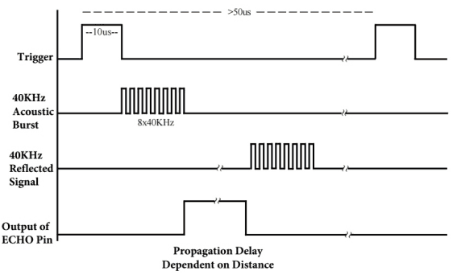

#### Schéma
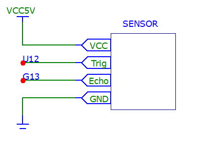

### Bzučák
Pro zvukovou signalizaci pomocí PWM jsme zvolili jednoduchý piezo bzučák s napájecím napětím 5V.

#### Schéma
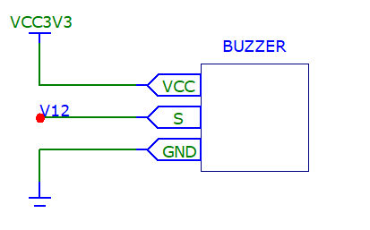

### LED bargraf
Pro signalizaci jsme zvolili 8 segmentový LED bargraf.
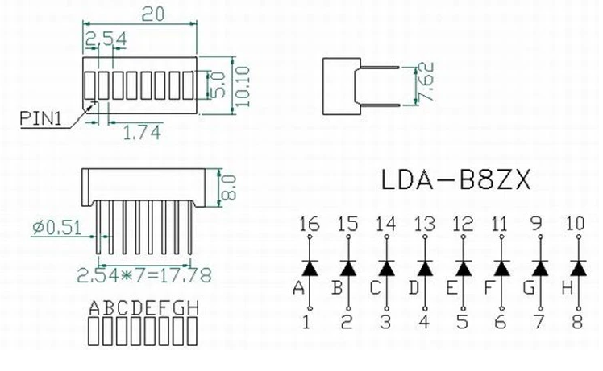

#### Schéma
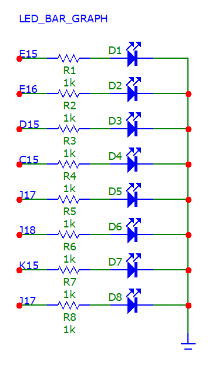

## Popis a simulace modulů VHDL:
### top

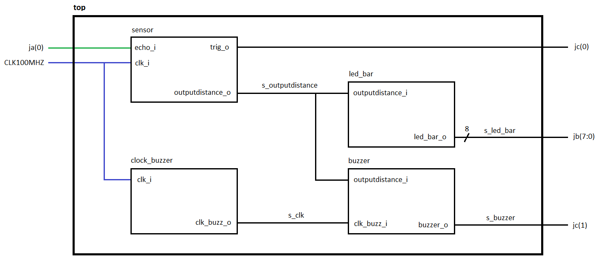

```vhdl
entity top is
  Port ( 
           CLK100MHZ : in STD_LOGIC;
          
           ja : in STD_LOGIC_VECTOR (8-1 downto 0);     -- sensor in
           jb : out STD_LOGIC_VECTOR (8-1 downto 0);    -- ledbar
           jc : out STD_LOGIC_VECTOR (2-1 downto 0)     -- sensor out, buzzer           
  );
end top;

architecture Behavioral of top is

signal s_outputdistance : integer := 0;
signal s_clk : std_logic;

begin

uut_sensor : entity work.sensor
        port map(
            clk_i     => CLK100MHZ,
            trig_o => jc(0),
            echo_i => ja(0),           
            outputdistace_o => s_outputdistance            
        );
        
uut_led_bar : entity work.led_bar
        port map(
            outputdistance_i => s_outputdistance,
            led_bar_o(0) => jb(0),
            led_bar_o(1) => jb(1),
            led_bar_o(2) => jb(2),
            led_bar_o(3) => jb(3),
            led_bar_o(4) => jb(4),
            led_bar_o(5) => jb(5),
            led_bar_o(6) => jb(6),
            led_bar_o(7) => jb(7)            
        );
        
uut_clock_buzzer : entity work.clock_buzzer
        port map(
            clk_i      => CLK100MHZ,                  
            clk_buzz_o    => s_clk      
        );            
        
uut_buzzer : entity work.buzzer
        port map(
            outputdistance_i => s_outputdistance,                                   
            buzzer_o => jc(1),
            clk_buzz_i => s_clk             
        );
                

end Behavioral;
```

### sensor
```vhdl
entity sensor is
    Port ( 
           trig_o : out STD_LOGIC;          --signal that will trigger the sensor
           echo_i : in STD_LOGIC;           --signal from the sensor
           clk_i  : in std_LOGIC;           --clock
           outputdistace_o : out integer    --real value of distance
                 
           );
end sensor;

architecture Behavioral of sensor is

type   t_state_echo is (WAIT_TRIG, SEND_TRIG);      --state machine
signal s_state_echo  : t_state_echo;                --signal of state machine


signal   s_cnt  : unsigned(24 - 1 downto 0):= b"0000_0000_0000_0000_0000_0000";         --counter for state machine
constant c_DELAY_60ms : unsigned(24 - 1 downto 0) := b"0101_1011_1000_1101_1000_0000";  --constant 60ms
constant c_DELAY_10us : unsigned(24 - 1 downto 0) := b"0000_0000_0000_0011_1110_1000";  --constant 10us
constant c_ZERO       : unsigned(24 - 1 downto 0) := b"0000_0000_0000_0000_0000_0000";  --constant zero


signal s_count : integer := 0;           --counter of echo signal width
signal s_outputdistance : integer := 0;  --signal of outputdistace_o

begin

p_send_trig : process (clk_i)
begin

if rising_edge (clk_i) then
    
    case (s_state_echo) is
                    when WAIT_TRIG =>
                        
                        if (s_cnt < c_DELAY_60ms) then
                            s_cnt <= s_cnt + 1;
                            trig_o <= '0';
                        else
                            s_state_echo <= SEND_TRIG;
                            s_cnt <= c_ZERO;
                        end if;    
                        
                    when SEND_TRIG => 
                    
                        if (s_cnt < c_DELAY_10us) then
                            s_cnt <= s_cnt + 1;
                            trig_o <= '1';
                        else
                            s_cnt <= c_ZERO;                            
                            s_state_echo <= WAIT_TRIG;
                        end if; 
    end case; 
end if;

end process p_send_trig;

p_get_echo : process (clk_i, echo_i)
begin

if echo_i = '1' then
    if rising_edge (clk_i) then    
        s_count <= s_count +1;
    end if;
end if;

if rising_edge (echo_i) then
    s_count <= 0;
end if;

if echo_i = '0' then    
    s_outputdistance <= s_count/5800;  
end if;

end process p_get_echo;

outputdistace_o <= s_outputdistance;


end Behavioral;
```

### tb_sensor
```vhdl
entity tb_sensor is
--  Port ( );
end tb_sensor;

architecture Behavioral of tb_sensor is

    -- Local constants
    constant c_CLK_100MHZ_PERIOD : time := 10 ns;
    constant c_60ms : time := 60 ms;
    constant c_10us : time := 10 us;    

    --Local signals
    signal s_clk_100MHz : std_logic;
    signal s_echo : std_logic;    
    signal s_time : time := 23200us;    
    
begin

    uut_sensor : entity work.sensor
        port map(
            clk_i   => s_clk_100MHz,
            echo_i  => s_echo                                          
        );

    --------------------------------------------------------------------
    -- Clock generation process
    --------------------------------------------------------------------
    p_clk_gen : process
    begin
        while now < 4000 ms loop   -- 4 sec of simulation
            s_clk_100MHz <= '0';
            wait for c_CLK_100MHZ_PERIOD / 2;
            s_clk_100MHz <= '1';
            wait for c_CLK_100MHZ_PERIOD / 2;
        end loop;
        wait;
    end process p_clk_gen;
          
    --------------------------------------------------------------------
    -- Data generation process
    --------------------------------------------------------------------
    p_stimulus : process
    begin
    s_echo <= '0';
    wait for c_60ms;
    while now < 4000 ms loop   -- 4 sec of simulation
            s_echo <= '0';
            wait for c_10us;
            s_echo <= '1';
            wait for s_time;            
            s_echo <= '0';
            wait for c_60ms - s_time;
            s_time <= s_time - 2400 us;
        end loop;
        wait;

    end process p_stimulus;

end Behavioral;
```

### Senzor simulace
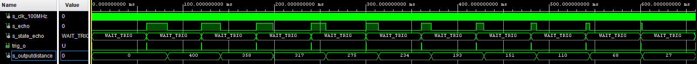

### led_bar
```vhdl
entity led_bar is
Port ( 
           outputdistance_i : in integer;                       --real value of distance
           led_bar_o : out std_logic_vector(8 - 1 downto 0)     --BUS for led bar                 
                 
           );
end led_bar;

architecture Behavioral of led_bar is

signal s_led_bar : std_logic_vector(8 - 1 downto 0);            --signal of led_bar_o

begin

set_led_bar : process(outputdistance_i)
begin

if (outputdistance_i < 400 AND outputdistance_i >= 350) then
    s_led_bar <= "00000001";
elsif (outputdistance_i < 350 AND outputdistance_i >= 300) then
    s_led_bar <= "00000011";
elsif (outputdistance_i < 300 AND outputdistance_i >= 250) then
    s_led_bar <= "00000111";
elsif (outputdistance_i < 250 AND outputdistance_i >= 200) then
    s_led_bar <= "00001111";
elsif (outputdistance_i < 200 AND outputdistance_i >= 150) then
    s_led_bar <= "00011111";
elsif (outputdistance_i < 150 AND outputdistance_i >= 100) then
    s_led_bar <= "00111111";
elsif (outputdistance_i < 100 AND outputdistance_i >= 50) then
    s_led_bar <= "01111111";
elsif (outputdistance_i < 50 AND outputdistance_i > 0) then
    s_led_bar <= "11111111";
else 
s_led_bar <= "00000000";
end if;

end process set_led_bar;

led_bar_o <= s_led_bar;


end Behavioral;
```

### tb_led_bar
```vhdl
entity tb_led_bar is
--  Port ( );
end tb_led_bar;

architecture Behavioral of tb_led_bar is

    signal s_outputdistance : integer;

begin

uut_led_bar : entity work.led_bar
        port map(
            outputdistance_i   => s_outputdistance                                          
        );
        
    --------------------------------------------------------------------
    -- Data generation process
    --------------------------------------------------------------------
    p_stimulus : process
    begin
        s_outputdistance <= 425;
        wait for 200ms;
        s_outputdistance <= 400;
        wait for 200ms;
        s_outputdistance <= 375;
        wait for 200ms;
        s_outputdistance <= 350;
        wait for 200ms;
        s_outputdistance <= 325;
        wait for 200ms;
        s_outputdistance <= 300;
        wait for 200ms;
        s_outputdistance <= 275;
        wait for 200ms;
        s_outputdistance <= 250;
        wait for 200ms;
        s_outputdistance <= 225;
        wait for 200ms;
        s_outputdistance <= 200;
        wait for 200ms;
        s_outputdistance <= 175;
        wait for 200ms;
        s_outputdistance <= 150;
        wait for 200ms;
        s_outputdistance <= 125;
        wait for 200ms;
        s_outputdistance <= 100;
        wait for 200ms;
        s_outputdistance <= 75;
        wait for 200ms;
        s_outputdistance <= 50;
        wait for 200ms;
        s_outputdistance <= 25;
   
        
        wait;

    end process p_stimulus;
   

end Behavioral;
```

### Led bar simulace
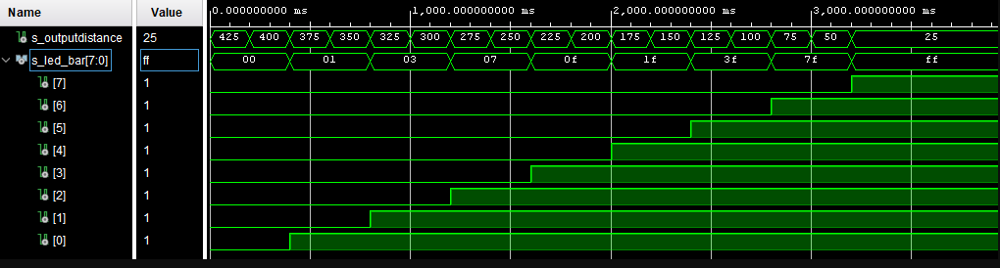

### clock_buzzer
```vhdl
entity clock_buzzer is
port(
        clk_i      : in  std_logic;     --original clock input     
        clk_buzz_o   : out std_logic    --transformed clock output
    );
end clock_buzzer;

architecture Behavioral of clock_buzzer is

signal s_cnt : unsigned(16 - 1 downto 0):= b"0000_0000_0000_0000";      --counter
signal s_clk : std_logic := '0';                                        --signal of clk_buzz_o
    
constant c_freq : unsigned(16 - 1 downto 0):= b"1100_1101_0001_0100";   --constant (52500)

begin

p_clock_buzzer : process(clk_i)
    begin
    
    if s_cnt = c_freq then
        s_clk <= not(s_clk);
        s_cnt <= (others => '0');
    end if;
    
    if rising_edge(clk_i) then        
        s_cnt <= s_cnt + 1;       
    end if;
    
end process p_clock_buzzer;
    
    clk_buzz_o <= s_clk;

end Behavioral;
```

### tb_clock_buzzer
```vhdl
entity tb_clock_buzzer is
--  Port ( );
end tb_clock_buzzer;

architecture Behavioral of tb_clock_buzzer is

constant c_CLK_100MHZ_PERIOD : time    := 10 ns;
   
signal s_clk_100MHz : std_logic;

begin

    uut_clock_buzzer : entity work.clock_buzzer
        port map(
            clk_i      => s_clk_100MHz            
        );

    --------------------------------------------------------------------
    -- Clock generation process
    --------------------------------------------------------------------
    p_clk_gen : process
    begin
        while now < 4000 ms loop         -- 4 sec of simulation
            s_clk_100MHz <= '0';
            wait for c_CLK_100MHZ_PERIOD / 2;
            s_clk_100MHz <= '1';
            wait for c_CLK_100MHZ_PERIOD / 2;
        end loop;
        wait;
    end process p_clk_gen;
   
    --------------------------------------------------------------------
    -- Data generation process
    --------------------------------------------------------------------
    p_stimulus : process
    begin
        
        wait;
    end process p_stimulus;
    

end Behavioral;
```

### Clock buzzer simulace
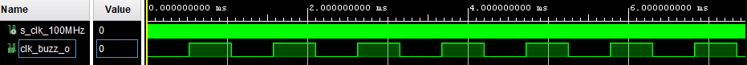

### buzzer
```vhdl
entity buzzer is
Port ( 
           outputdistance_i : in integer;       --real value of distance              
           clk_buzz_i : in std_LOGIC := '0';    --transformed clock input
           buzzer_o : out std_logic             --buzzer output
                 
           );
end buzzer;

architecture Behavioral of buzzer is

signal s_buzzer : std_logic := '0';             --signal of buzzer output
signal s_buzzer_freq : time := 0ms;             --time variable for buzzer frquency

begin

buzzer : process (clk_buzz_i)
begin

if rising_edge(clk_buzz_i) then
    if(s_buzzer_freq /= 0us) then
        s_buzzer <= '0';
        s_buzzer <= '1' after s_buzzer_freq;
    end if;
end if;

end process buzzer;

buzzer_freq : process(outputdistance_i)
begin

if (outputdistance_i < 400 AND outputdistance_i > 350) then
    s_buzzer_freq <= 1050us;
elsif (outputdistance_i < 350 AND outputdistance_i > 300) then
    s_buzzer_freq <= 900us;
elsif (outputdistance_i < 300 AND outputdistance_i > 250) then
    s_buzzer_freq <= 750us;
elsif (outputdistance_i < 250 AND outputdistance_i > 200) then
    s_buzzer_freq <= 600us;
elsif (outputdistance_i < 200 AND outputdistance_i > 150) then
    s_buzzer_freq <= 450us;
elsif (outputdistance_i < 150 AND outputdistance_i > 100) then
    s_buzzer_freq <= 300us;
elsif (outputdistance_i < 100 AND outputdistance_i > 50) then
    s_buzzer_freq <= 150us;
elsif (outputdistance_i < 50 AND outputdistance_i > 0) then
    s_buzzer_freq <= 0us;
end if;

end process buzzer_freq;

buzzer_o <= s_buzzer;

end Behavioral;
```

### tb_buzzer
```vhdl
entity tb_buzzer is
--  Port ( );
end tb_buzzer;

architecture Behavioral of tb_buzzer is

    constant c_buzz_freq : time := 525 us;
    signal s_outputdistance : integer;
    signal s_clk_buzz : std_logic;

begin

    uut_buzzer : entity work.buzzer
        port map(
            outputdistance_i   => s_outputdistance,
            clk_buzz_i   => s_clk_buzz
        );
        
    p_clkbuzz : process
    begin
        while now < 4000 ms loop   -- 4 sec of simulation
            s_clk_buzz <= '0';
            wait for c_buzz_freq;
            s_clk_buzz <= '1';
            wait for c_buzz_freq;
        end loop;
        wait;
    end process p_clkbuzz;
    
    --------------------------------------------------------------------
    -- Data generation process
    --------------------------------------------------------------------
    p_stimulus : process
    begin
        s_outputdistance <= 425;
        wait for 2ms;
        s_outputdistance <= 400;
        wait for 2ms;
        s_outputdistance <= 375;
        wait for 2ms;
        s_outputdistance <= 350;
        wait for 2ms;
        s_outputdistance <= 325;
        wait for 2ms;
        s_outputdistance <= 300;
        wait for 5ms;
        s_outputdistance <= 275;
        wait for 5ms;
        s_outputdistance <= 250;
        wait for 5ms;
        s_outputdistance <= 225;
        wait for 5ms;
        s_outputdistance <= 200;
        wait for 5ms;
        s_outputdistance <= 175;
        wait for 5ms;
        s_outputdistance <= 150;
        wait for 5ms;
        s_outputdistance <= 125;
        wait for 5ms;
        s_outputdistance <= 100;
        wait for 5ms;
        s_outputdistance <= 75;
        wait for 5ms;
        s_outputdistance <= 50;
        wait for 5ms;
        s_outputdistance <= 25; 
    
        
        wait;

    end process p_stimulus;
    


end Behavioral;
```

### Buzzer simulace
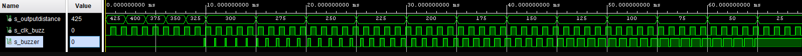

## Video:
[Link](https://www.youtube.com/watch?v=UANIZdxbZUs)

## Použité zdroje:
1) Deska - https://reference.digilentinc.com/reference/programmable-logic/arty-a7/reference-manual
2) Ultrazvukový senzor - https://cdn.sparkfun.com/datasheets/Sensors/Proximity/HCSR04.pdf
3) Bzučák - https://www.pantechsolutions.net/blog/buzzer-interface-with-fpga/
4) Informace - https://github.com/tomas-fryza/Digital-electronics-1
